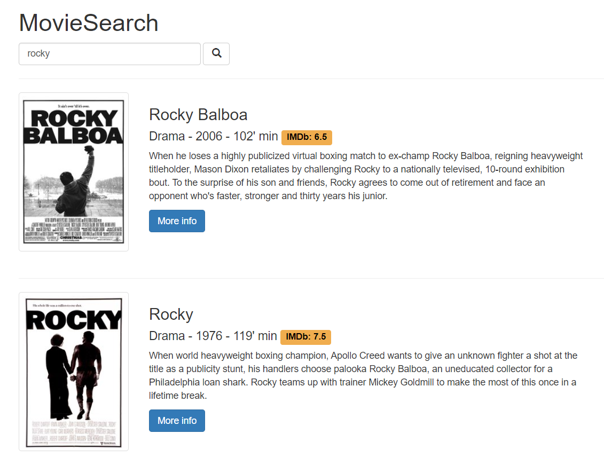
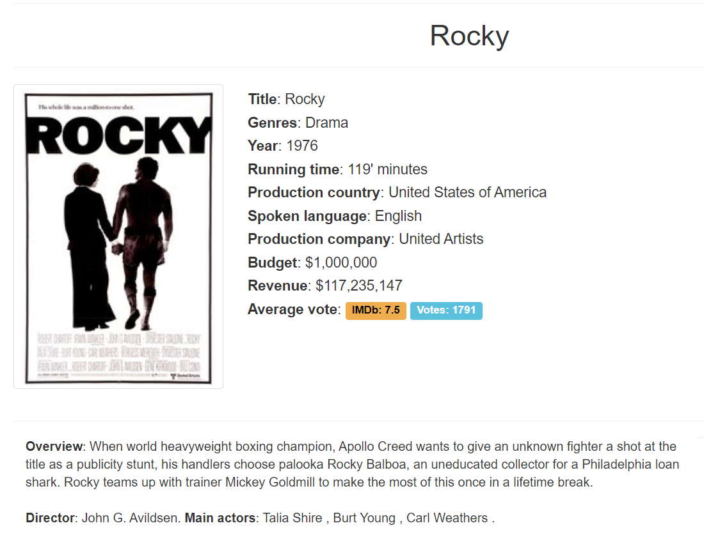
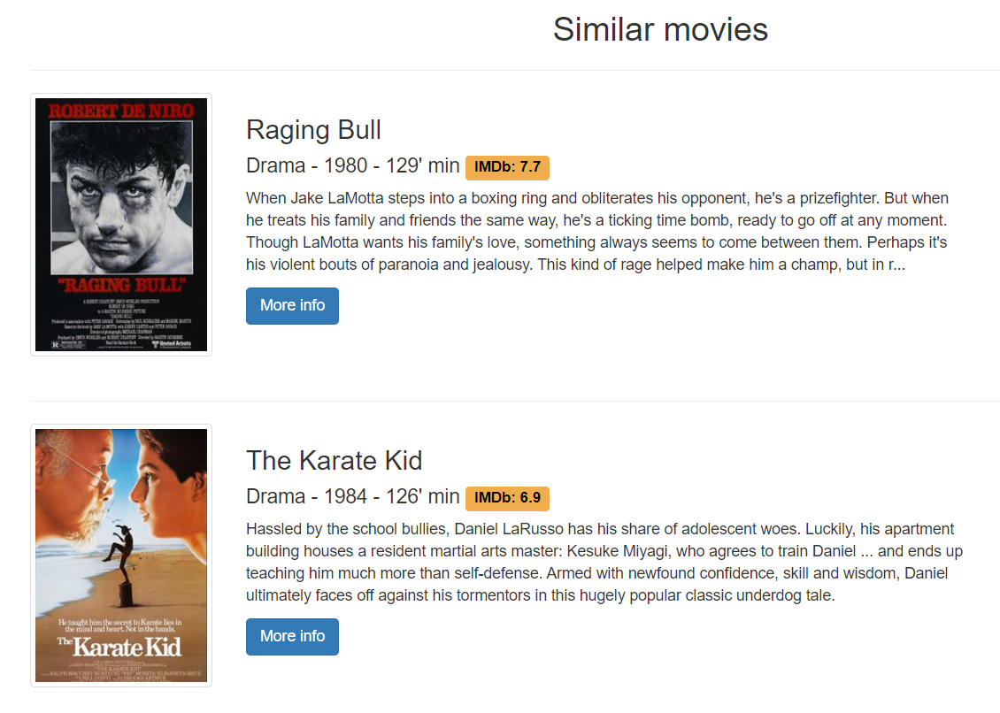

# MovieSearch

**MovieSearch** is a content specific search engine with the aim to retrieve **movies** informations given the contents of the user's query. The search engine relies on the **OkapiBM25** algorithm and takes into consideration the overview, the title, the name of the director, of the actors and of the production companies of each movie. The backend has been developed with the framework **Django** while the front-end extensively relies on **Bootstrap 4**. Movies data, reviews and a reverse index to speed up the research are stored in a **MongoDB** database. It has also been implemented a movies **recommendation system** to recommend similar movies exploiting a nearest neighbors machine learning algorithm. Moreover, before uploading, movies reviews have been classified into two categories, positive and negatives, exploiting a pretrained Bert model fine tuned on the Imdb reviews dataset.

</a>

</a>

</a>

## Environment configuration
- Download movies posters dataset from https://www.kaggle.com/neha1703/movie-genre-from-its-poster/discussion/35485 and put all images into the folder `moviesearch/static/posters`.
- Download movies reviews from http://ai.stanford.edu/~amaas/data/sentiment/ and put the folder `aclImdb` in the path `moviesearch\utils`.
- The website relies on MongoDB, make sure it is running on your machine before going on. Otherwise you can download and install it from https://www.mongodb.com/.
- Install all dependencies with the command: `pip install requirements.txt`.

## Database preparation
- To clean, preprocess and upload movies data run the command `python moviesearch/utils/upload_movies.py`. Note that the execution of this process includes computing movies recommendations for about 5000 movies with with nearest neightbors, thus it may take a few hours depending on your hardware.
- To clean, preprocess and upload movies reviews run the command `python moviesearch/utils/upload_reviews.py`. It will upload around 50k movies reviews.

## Run the server
- Finally, you can run your server with the command `python manage.py runserver`.
- You will find the website at the location `http://127.0.0.1:8000/`.

## References
- https://www.kaggle.com/neha1703/movie-genre-from-its-poster/discussion/35485
- http://ai.stanford.edu/~amaas/data/sentiment/
- https://www.mongodb.com/
- https://data-flair.training/blogs/django-tutorial/
- https://www.kaggle.com/rounakbanik/the-movies-dataset
- https://www.kaggle.com/fabiendaniel/film-recommendation-engine
- https://www.kaggle.com/tmdb/tmdb-movie-metadata
